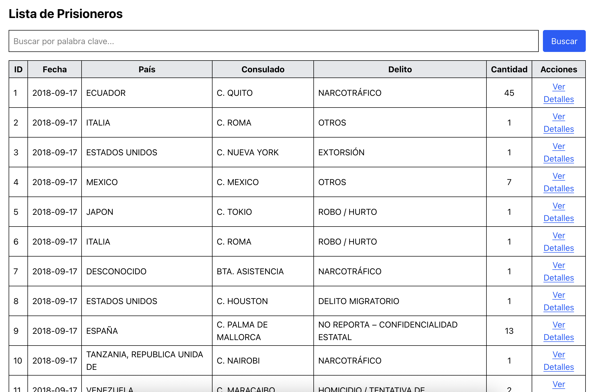
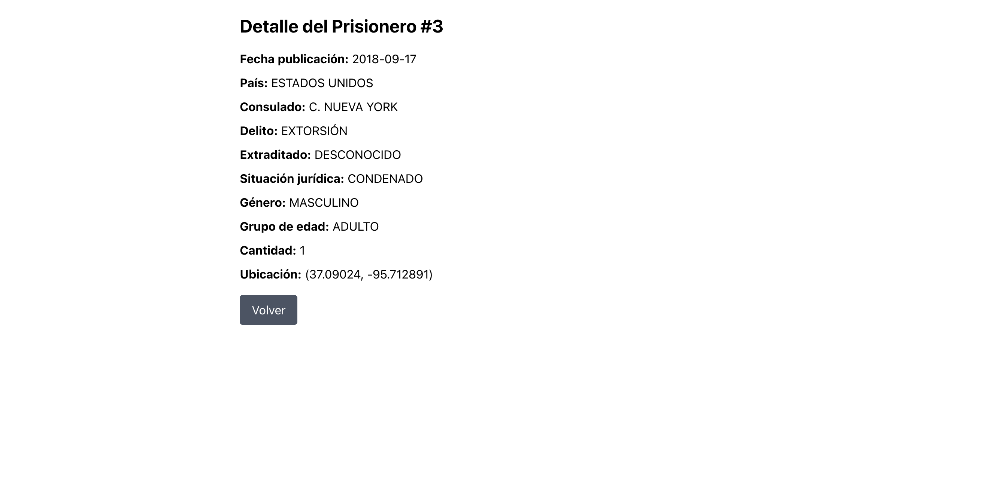

# Prueba Tecnica Kitsune

## Indice
- [Orden de Carpetas](#orden-de-carpetas)
- [Guia de Inicio Rapido](#guia-de-inicio-rapido)
- [API](#API)
- [WEB](#WEB)
- [Uso de IA](#Uso-de-IA)

---

# Orden de Carpetas
```
.
├── api
├── docker-compose.yml
├── etl
├── web
├── img_doc
└── README.md
```

### Carpeta api
Se maneja todo el api con fastAPI para el punto #2.

### Carpeta etl
Se maneja el script necesario para consumir el api de `datos.gov.co` y almacenarlo en base de datos.

### Carpeta web
Se maneja el front end, con next.js para el punto #3.

### Carpeta img_doc
Se agregan las capturas pertenecientes a la documentacion.

### docker-compose.yml
Tiene la estructura de los contenedores `API` y `DB`


# Guia de Inicio Rapido
### API y DB
- Ejecutar `docker compose up --build` si es la priemera vez.
- Ejecutar `docker compose up` si ya existe el contenedor.

### ETL
- Es necesario crear un entorno de desarrollo con python `python3 -m venv env`.
- Ejecutarlo con `source env/bin/activate`.
- Instalar las librerias necesarias con `pip install -r requirements.txt`.
- Ejecutar `script.py` con `python script.py` dento de la carpeta `etl`

### WEB
- Ejecutar `npm install` si es la primera vez.
- Ejecutar `npm run dev`, si ya se ejecuto `npm install`.


# API
A travez de `http://127.0.0.1:8001/docs` o `http://127.0.0.1:8001/redoc`, se puede ver la funcionalidad de los endpoints e incluso porbarlos sin la necesidad de postman.

### Endpoints
- `/prisioneros/` -> Listar
- `/prisioneros/{prisionero_id}` -> Buscar por id
- `/prisioneros/fecha/{fecha}` -> Filtrar por fecha
- `/prisioneros/buscar/{palabra}` -> Filtar por palabra (delito cometido)

# WEB
Con next.js, un framework de react, se crea el front end, necesario que consume el `API` de `Fast API`.

### Intefaz
Al entrar en `http://localhost:3000/`, se obtiene:

1. Un buscador por delito cometido, (tiene que respetar mayusculas, tildes, etc).
2. Lista de la base de datos consultada, donde se pude ver a detalle el prisionero seleccionado.



Al ver detalle del prisionero se obtiene

1. Detalle del prisionero.
2. Boton de regresar, para volver a la tabla de prisionero.



# Uso de IA
Se utilizó IA para el desarrollo de esta prueba, diagnostica como una herramienta para optimizar tiempos, de la siguiente forma.

1. Dokerizacion: Al usar IA, para generar la dockerizacion principal y evitar errores, con ello ser mas productivo e invertir tiempo en los otros puntos de la prueba.

2. Correccion de Errores: al implementar el ORM de `sqlalchemy`, se genero una serie de errores, que no permitia la coneccion de la tabla creada con el api. Con la IA se corrigio.

3. Preguntas de Implementacion: Se le pregunta a la IA como actuar en siertos eventos donde no existe una buena claridad para desarrollar un problema. Tal caso como el entendimiento de las nuevas versiones de `Next.js` y de `tailwindcss`.

4. Ayuda con la coneccion sencilla del `API` desde `NEXT.JS`.